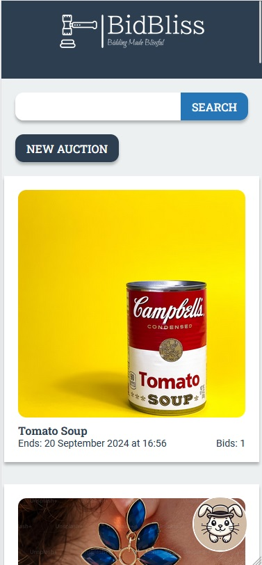

# BidBliss



This is my work for my Semester Project 2 delivery.
The online auction marketplace that makes bidding blissful!
An auction marketplace that keeps the buyers and sellers anonymous while maintaining a elegant design and layout.
Upon registering users are given 1000 credits to use on the page.

## User Stories:

- An unregistered user may search through listings.
- A user with a stud.noroff.no email may register.
- A registered user may login.
- A registered user may logout.
- A registered user may update their avatar.
- A registered user may view their total credits.
- A registered user may create a listing with a title, deadline date, media gallery, and description.
- A registered user may add a bid to another user's listing.
- A registered user may view bid's made on a listing.

## Project planning:

- Uses Trello for Kanban project board.
- Uses Notion for Gantt chart.
  [Kanban Project Board](https://trello.com/b/Jxtr9gbZ/semester-project-2)
  [Gantt Chart](https://boom-product-603.notion.site/570d36266954441c91671c628158ca61?v=a39ab7e5cd884c36890833a8a17f2651)

## Design:

- Design, styleguide and prototype was created in Figma.
  [Design Prototype](https://www.figma.com/design/Yo3btppfrxwhyh76QbaFRe/SP2?node-id=299-1715&m=dev)
  [Style Guide](https://www.figma.com/design/Yo3btppfrxwhyh76QbaFRe/SP2?node-id=352-3242&m=dev&t=0p6Ju4oO17eI0Dso-1)

## Hosted Demo:

- Hosted at Netlify.
  [BidBliss](https://bidbliss.netlify.app/)
  [](https://app.netlify.com/sites/bidbliss/deploys)

## Reflections on my planning:

I found quite early that my planning was off and that this project was going to require more from me than I had originally expected.
Close to 900 commits and 30+ PR's later I look back at my journey for the past 5 weeks recognizing that I have learned so much from all the research i was forced to do and I now feel like i have improved my skills quite a bit.
I was planning to take some time off to not have a repeat off my experience with fatigue from last exam, but there was no room for it.
Luckily I didn't experience the level of fatigue I did back then.
Overall I am pretty satisfied with my delivery.

## The Environment has been configured with:

- Vite: bundler
- TailwindCSS
- PostCSS
- Prettier
- Eslint
- Jest
- Cypress

## Getting Started:

### Installing

1. Clone the repo:

```bash
git clone git@github.com:jonhenrikaavitsland/bid-bliss.git
```

2. Install the dependencies:

```
npm install
```

### Running

To run the app, run the following commands:

```bash
npm run dev
```

## Testing:

### I had planned to conduct unit-testing and e2e-testing for this project, but time was not on my side.

#### Since testing was not required, but i had planned to perform it, I have left the project configured and ready for future tester to write testing code.

##### The only tests which are performed for the badges in this readme file are a few baseline tests.

[](https://github.com/jonhenrikaavitsland/bid-bliss/actions/workflows/e2e-test.yml)
[](https://github.com/jonhenrikaavitsland/bid-bliss/actions/workflows/unit-test.yml)

### To run tests:

```runs both Jest and Cypress
npm run test
```

```runs Jest in terminal
npm run test-unit
```

```runs Cypress in terminal
npm run test-e2e-cli
```

```opens Cypress in external window
npm run test-e2e
```

## Contact:

- Jon Henrik Åvitsland
  [Jon's LinkedIn page](https://www.linkedin.com/in/jon-henrik-aavitsland-abaa872b7/)
